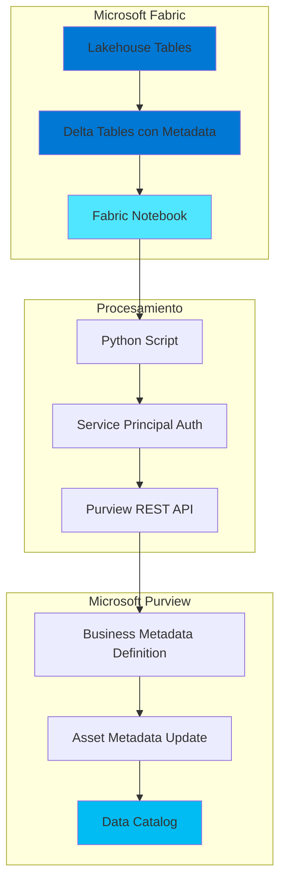

# Purview Metadata Uploader for Fabric

Automatiza la actualización de metadatos de activos de Microsoft Purview desde Microsoft Fabric usando Python notebooks.

## 🎯 Propósito

Esta solución permite mantener sincronizados los metadatos de gobernanza de datos (descripciones, propietarios, sensibilidad, etc.) almacenados en tu lakehouse de Fabric y el catálogo de Purview, facilitando la gestión centralizada de metadatos a escala.

## 🏗️ Arquitectura



## ✨ Características

- ✅ Autenticación con Service Principal
- ✅ Creación automática de Business Metadata definitions
- ✅ Actualización masiva de metadatos (descripción, propietarios, sensibilidad, etc.)
- ✅ Soporte para Fabric Lakehouse Tables
- ✅ Logging detallado de operaciones
- ✅ Manejo de errores robusto

## 📋 Prerequisitos

- Microsoft Fabric workspace con Lakehouse
- Microsoft Purview account
- Service Principal con permisos:
  - **Fabric**: Contributor en el workspace
  - **Purview**: Data Curator role

## 🚀 Inicio Rápido

1. **Clonar el repositorio**
   ```bash
   git clone https://github.com/your-org/purview-metadata-uploader.git
   cd purview-metadata-uploader
   ```

2. **Configurar credenciales**
   - Copia `config.template.json` a `config.json`
   - Completa con tus credenciales (nunca hacer commit de `config.json`)

3. **Importar notebook a Fabric**
   - Sube `notebook/PurviewMetadataUploader.ipynb` a tu workspace de Fabric
   - Adjunta el notebook a tu Lakehouse

4. **Preparar datos de metadata**
   - Crea las tablas `tablas_metadata` y `campos_metadata` en tu Lakehouse
   - Estructura requerida: ver [IMPLEMENTATION_GUIDE.md](IMPLEMENTATION_GUIDE.md)

5. **Ejecutar**
   - Configura las variables en la primera celda del notebook
   - Ejecuta las celdas en orden

## 📁 Estructura del Proyecto

```
.
├── README.md                          # Este archivo
├── IMPLEMENTATION_GUIDE.md            # Guía paso a paso detallada
├── config.template.json               # Template de configuración
├── notebook/
│   └── PurviewMetadataUploader.ipynb # Notebook de Fabric
└── .gitignore                         # Archivos a ignorar
```

## 🔐 Seguridad

- ⚠️ **NUNCA** hacer commit de credenciales reales
- Usa variables de entorno o Azure Key Vault en producción
- El archivo `config.json` está en `.gitignore`
- Rota Service Principal secrets regularmente

## 📊 Metadatos Soportados

### Business Metadata "DataGovernance"
- **Expert**: Email del experto técnico
- **Owner**: Email del propietario del dato
- **Source**: Sistema fuente
- **Refresh_Frequency**: Frecuencia de actualización
- **Data_Sensitivity**: Nivel de sensibilidad (High/Medium/Low)
- **Retention_Period**: Periodo de retención
- **Business_Owner**: Propietario de negocio

## 🤝 Contribuciones

Las contribuciones son bienvenidas. Por favor:
1. Fork el repositorio
2. Crea una rama feature (`git checkout -b feature/AmazingFeature`)
3. Commit tus cambios (`git commit -m 'Add some AmazingFeature'`)
4. Push a la rama (`git push origin feature/AmazingFeature`)
5. Abre un Pull Request

## 📄 Licencia

Este proyecto está bajo licencia MIT. Ver archivo `LICENSE` para más detalles.

## 📞 Soporte

Para preguntas o problemas, abre un Issue en GitHub.

## 🙏 Reconocimientos

- Microsoft Fabric documentation
- Microsoft Purview REST API documentation
- Comunidad de Azure Data & AI
